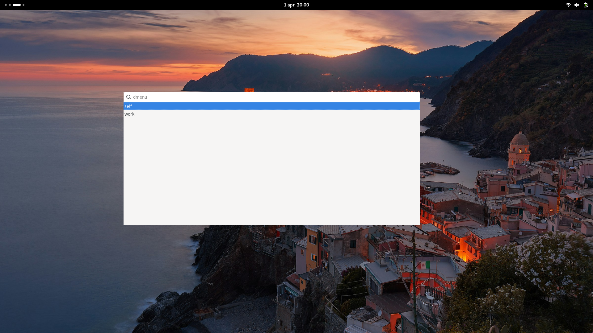

# Wofizilla
A [wofi](https://hg.sr.ht/~scoopta/wofi)-based profile launcher inspired by [rofirefox](https://github.com/ethmtrgt/rofirefox). It's compatible with any mozilla-like `.ini` file profiles, including Firefox, Thunderbird and Zen Browser.

## Installation
### Nix
Add the following to your `flake.nix`.
```nix
runzilla.url = "github:valyntyler/runzilla";
runzilla.inputs.nixpkgs.follows = "nixpkgs";
```
Then, enable the package by adding `wofizilla.packages.x86_64-linux.wozilla` to your system packages.

## Usage
```bash
wofizilla <command>: [ zen | firefox | thunderbird]
```

## Preview

